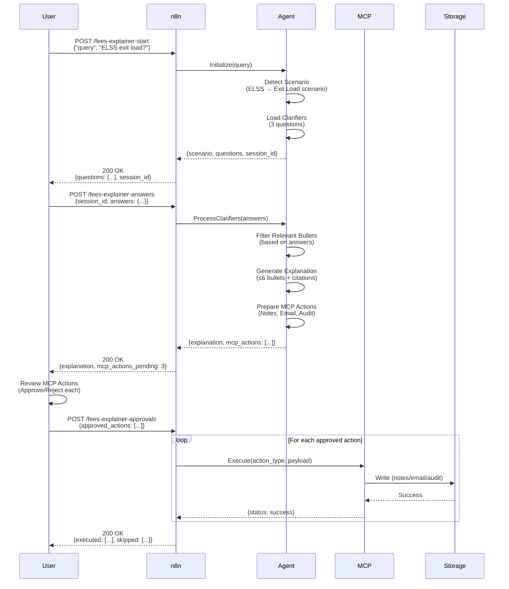
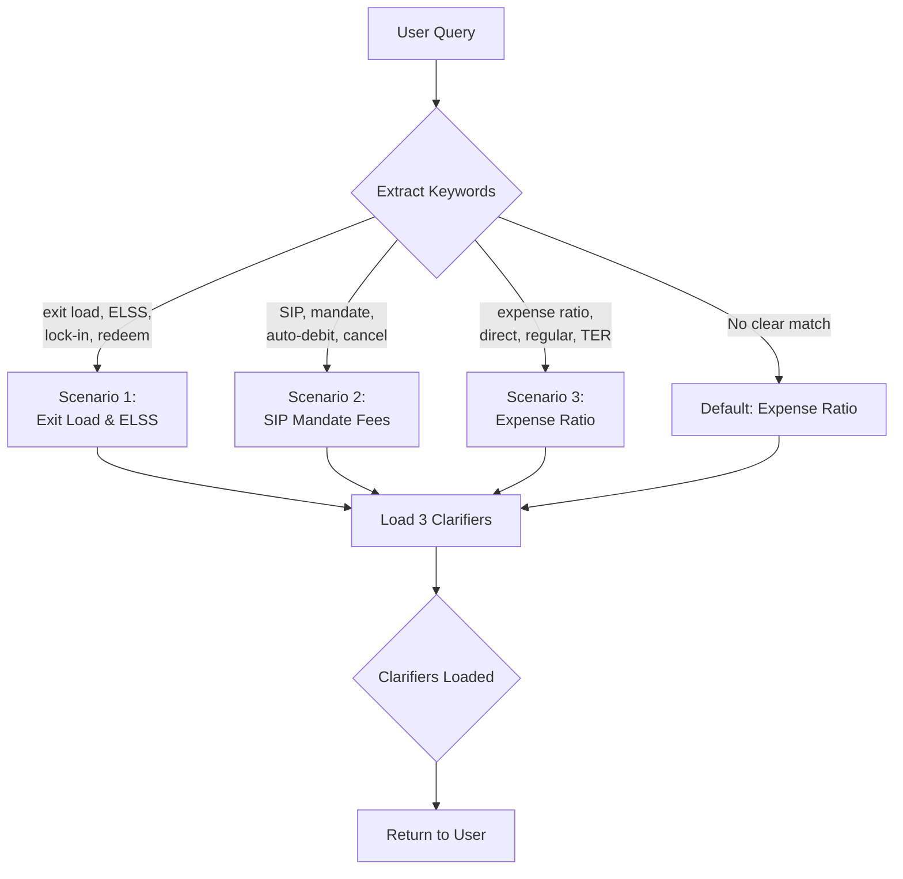
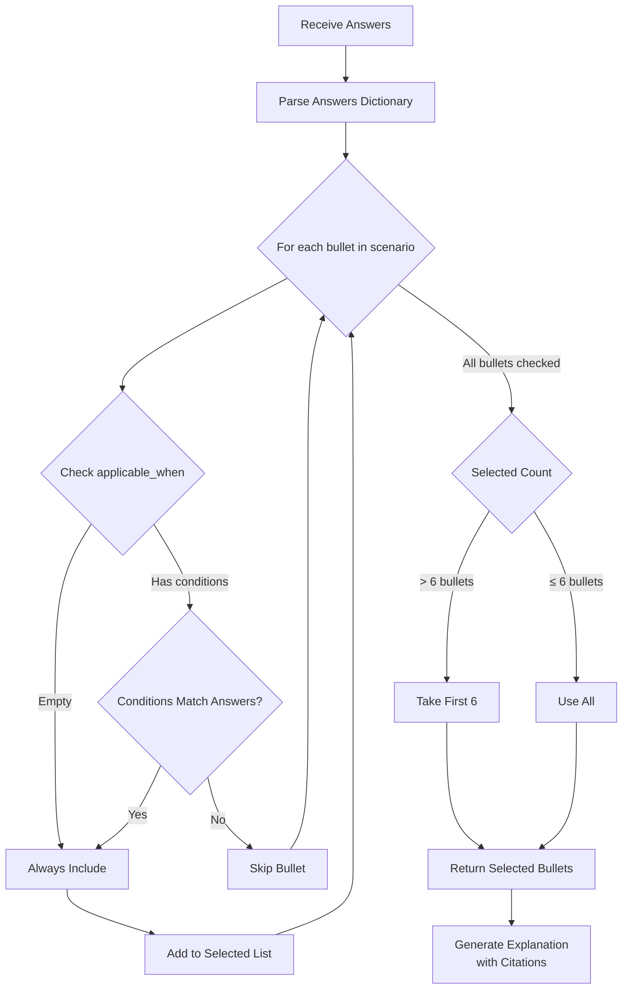
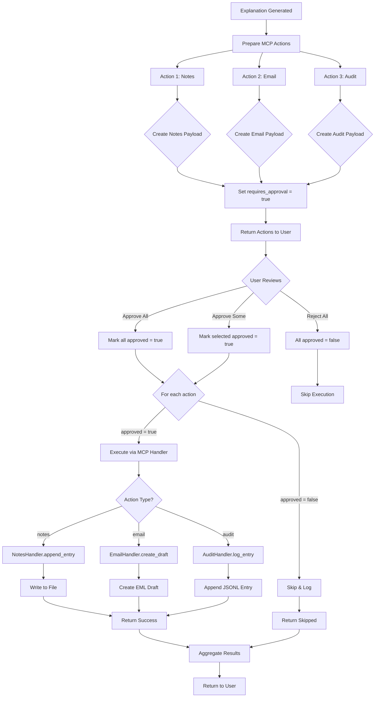

# Architecture & Flow Design

> Detailed architecture documentation for the Fees Explainer Agent with n8n + MCP integration

---

## System Architecture

### High-Level Components

```
┌──────────────────────────────────────────────────────────────┐
│                        USER LAYER                            │
│  (Web UI / Mobile App / API Client / Chatbot)                │
└────────────────────────┬─────────────────────────────────────┘
                         │
                         │ HTTP/Webhook
                         ▼
┌──────────────────────────────────────────────────────────────┐
│                   ORCHESTRATION LAYER                         │
│                    (n8n Workflow)                             │
│                                                               │
│  ┌────────────┐  ┌────────────┐  ┌────────────┐             │
│  │  Webhook   │  │  State     │  │  Approval  │             │
│  │  Handler   │  │  Manager   │  │  Gateway   │             │
│  └────────────┘  └────────────┘  └────────────┘             │
└────────────────────────┬─────────────────────────────────────┘
                         │
         ┌───────────────┼───────────────┐
         │               │               │
         ▼               ▼               ▼
┌─────────────┐  ┌─────────────┐  ┌─────────────┐
│   AGENT     │  │     MCP     │  │   DATA      │
│   LAYER     │  │   LAYER     │  │   LAYER     │
│             │  │             │  │             │
│  Fees       │  │  Notes      │  │  Notes      │
│  Explainer  │  │  Handler    │  │  File       │
│  Agent      │  │             │  │             │
│             │  │  Email      │  │  Email      │
│  - Detect   │  │  Handler    │  │  Drafts     │
│  - Clarify  │  │             │  │             │
│  - Explain  │  │  Audit      │  │  Audit      │
│  - Prepare  │  │  Handler    │  │  Log        │
│             │  │             │  │             │
└─────────────┘  └─────────────┘  └─────────────┘
```

---

## Detailed Flow Diagrams

### 1. Complete User Journey



---

### 2. Scenario Detection Logic



**Scenario Mapping Table**:

| Keywords | Scenario | Clarifiers |
|----------|----------|------------|
| exit load, ELSS, lock-in, redemption | Exit Load & ELSS Lock-in Period | Fund type (ELSS/non-ELSS), Redemption timing, Investment mode (SIP/lumpsum) |
| SIP, mandate, auto-debit, autopay, cancel | SIP Mandate Fees & Cancellation | Action (setup/cancel/modify), Bank, SIP amount range |
| expense ratio, TER, direct plan, regular plan, charges | Expense Ratio (Direct vs Regular) | Plan type (Direct/Regular), Fund category (Equity/Debt/Hybrid), Impact understanding |

---

### 3. Clarifier Processing & Bullet Selection



**Example Matching Logic**:

```python
# Bullet definition
{
  "text": "ELSS has 3-year lock-in per installment for SIP",
  "source": "https://groww.in/p/tax-saving-funds/",
  "applicable_when": {
    "fund_type": "ELSS",
    "investment_type": "SIP"
  }
}

# User answers
{
  "fund_type": "ELSS",
  "investment_type": "SIP",
  "redemption_period": "after_3_years"
}

# Match result: ✓ Include (fund_type and investment_type match)
```

---

### 4. MCP Action Preparation & Approval Flow



---

### 5. n8n Webhook Routing

```
┌─────────────────────────────────────────────────────────────┐
│                    n8n Webhook Router                        │
└─────────────────────────────────────────────────────────────┘

Webhook 1: /fees-explainer-start (POST)
├─ Input: {"query": string}
├─ Process:
│  ├─ Extract query
│  ├─ Initialize Agent
│  ├─ Detect scenario
│  └─ Load clarifiers
└─ Output: {scenario, questions[], session_id}

Webhook 2: /fees-explainer-answers (POST)
├─ Input: {"session_id": string, "answers": {}}
├─ Process:
│  ├─ Validate session_id
│  ├─ Process answers
│  ├─ Generate explanation
│  └─ Prepare MCP actions
└─ Output: {explanation, mcp_actions[]}

Webhook 3: /fees-explainer-approvals (POST)
├─ Input: {"session_id": string, "approved_actions": []}
├─ Process:
│  ├─ Validate session_id
│  ├─ Route to Switch node
│  ├─ Execute approved actions
│  └─ Aggregate results
└─ Output: {executed[], skipped[], errors[]}

Switch Node: Action Type Router
├─ Route 1 (notes): → MCP NotesHandler → Write File
├─ Route 2 (email): → MCP EmailHandler → Create Draft
└─ Route 3 (audit): → MCP AuditHandler → Append Log
```

---

### 6. Data Flow & State Management

```mermaid
graph LR
    A[User Query] --> B[Session ID Generated]
    B --> C[State: {scenario, clarifiers_asked}]

    C --> D[User Answers]
    D --> E[State: {scenario, clarifiers_asked,<br/>clarifiers_answers, selected_bullets}]

    E --> F[MCP Actions Prepared]
    F --> G[State: {scenario, ... , mcp_actions[]}]

    G --> H[User Approvals]
    H --> I[State: {scenario, ... , mcp_actions[approved]}]

    I --> J[Execution]
    J --> K[State: {scenario, ... , execution_results}]

    K --> L[Final Summary]
```

**State Object Structure**:

```json
{
  "session_id": "1734234567890",
  "scenario": "Exit Load & ELSS Lock-in Period",
  "clarifiers_asked": ["question1", "question2", "question3"],
  "clarifiers_answers": {
    "question1": "ELSS",
    "question2": "After 3 years",
    "question3": "SIP"
  },
  "selected_bullets": [
    {"text": "...", "source": "..."},
    {"text": "...", "source": "..."}
  ],
  "mcp_actions": [
    {"action_id": 0, "action_type": "notes", "approved": true},
    {"action_id": 1, "action_type": "email", "approved": true},
    {"action_id": 2, "action_type": "audit", "approved": false}
  ],
  "execution_results": {
    "executed": [0, 1],
    "skipped": [2],
    "errors": []
  }
}
```

---

## File System Structure

### Output Files

```
/home/user/
├── fees_explanations.md          # Notes file (MCP: append_to_notes)
│   ├── Header
│   ├── Entry 1 (Date, Scenario, Bullets, Sources)
│   ├── Entry 2
│   └── ...
│
├── email_drafts/                 # Email drafts directory
│   ├── draft_20251215_103045.eml
│   ├── draft_20251215_110230.eml
│   └── ...
│
└── audit_log.jsonl               # Audit log (JSONL format)
    ├── {"who": "...", "when": "...", "action": "..."}
    ├── {"who": "...", "when": "...", "action": "..."}
    └── ...
```

### Notes File Format (Markdown)

```markdown
# Fee Explanations Log

Auto-generated by Fees Explainer Agent

---

## Fee Explanation: Exit Load & ELSS Lock-in Period
**Date:** 2025-12-15T10:30:45.123Z
**Scenario:** Exit Load & ELSS Lock-in Period
**Last Checked:** 2025-12-15

**Context:**
- Q: Are you asking about ELSS or non-ELSS?
  A: ELSS
- Q: Is this SIP or lumpsum?
  A: SIP

**Fee Details:**

1. ELSS funds have a mandatory 3-year lock-in period as per Section 80C.
   📎 Source: https://groww.in/p/tax-saving-funds/

2. For SIP investments, each installment has separate 3-year lock-in.
   📎 Source: https://groww.in/p/tax-saving-funds/

---
```

### Email Draft Format (EML/RFC 822)

```
To: support@groww.in
Subject: Fee Clarification Request: Exit Load & ELSS Lock-in Period
Date: 2025-12-15T10:30:45.123Z
X-Draft: true
X-Created-By: FeesExplainerAgent

Dear Support Team / Advisor,

I would like clarification on the following fee scenario: Exit Load & ELSS Lock-in Period

Fee Details (based on official sources):

1. ELSS funds have a mandatory 3-year lock-in period as per Section 80C.
   Source: https://groww.in/p/tax-saving-funds/

2. For SIP investments, each installment has separate 3-year lock-in.
   Source: https://groww.in/p/tax-saving-funds/

Last Checked: 2025-12-15

Please confirm if the above information is accurate.

Best regards
```

### Audit Log Format (JSONL)

```jsonl
{"who":"FeesExplainerAgent","when":"2025-12-15T10:30:45.123Z","action":"Generated fee explanation for: Exit Load & ELSS","details":{"scenario":"Exit Load & ELSS Lock-in Period","clarifiers_count":3,"bullets_count":5},"logged_at":"2025-12-15T10:30:45.789Z"}
{"who":"FeesExplainerAgent","when":"2025-12-15T11:15:30.456Z","action":"Generated fee explanation for: SIP Mandate Fees","details":{"scenario":"SIP Mandate Fees & Cancellation","clarifiers_count":3,"bullets_count":4},"logged_at":"2025-12-15T11:15:30.890Z"}
```

---

## Security & Compliance

### Approval Gating Implementation

```python
class MCPServer:
    def execute_tool(self, tool_name, params, approved=False):
        if not approved:
            raise ApprovalRequired(
                tool_name=tool_name,
                prompt=self._get_approval_prompt(tool_name, params),
                payload=params
            )

        # Execute only after approval
        return self._handlers[tool_name](**params)
```

### No Auto-Send Enforcement

```python
def create_email_draft(self, to, subject, body, draft_only=True):
    if not draft_only:
        raise ValueError("Auto-send not allowed. draft_only must be True.")

    # Create draft only
    self._save_draft(to, subject, body)
```

### PII Protection

- **Agent**: Never asks for name, email, phone, account details
- **Storage**: No PII in notes, emails, or audit logs
- **Clarifiers**: Only technical/categorical questions (fund type, amount ranges)

---

## Performance Considerations

### Latency Breakdown

| Stage | Expected Latency | Notes |
|-------|------------------|-------|
| Scenario Detection | < 100ms | Keyword matching |
| Clarifier Loading | < 50ms | Dictionary lookup |
| Answer Processing | < 200ms | Bullet filtering |
| MCP Execution (Notes) | < 500ms | File append |
| MCP Execution (Email) | < 300ms | File create |
| MCP Execution (Audit) | < 200ms | JSONL append |
| **Total (end-to-end)** | **< 2 seconds** | All 3 MCP actions |

### Scalability

- **Stateless Agent**: Each session is independent
- **File-based Storage**: Suitable for moderate load (< 100 req/min)
- **For High Scale**: Replace file storage with database (PostgreSQL/MongoDB)

---

## Error Handling

### Error Scenarios & Responses

1. **Invalid Session ID**
   ```json
   {"error": "Invalid session_id", "status": 400}
   ```

2. **MCP Action Failure**
   ```json
   {
     "executed": [0],
     "errors": [
       {"action_id": 1, "error": "Permission denied: /home/user/email_drafts/"}
     ]
   }
   ```

3. **Network Timeout**
   - n8n workflow timeout: 300 seconds (configurable)
   - Retry logic: 3 attempts with exponential backoff

---

## Monitoring & Observability

### Key Metrics

- **Request Rate**: Queries per minute
- **Scenario Distribution**: ELSS vs SIP vs Expense Ratio
- **Approval Rate**: % of MCP actions approved
- **Execution Success Rate**: % of approved actions that succeed
- **Latency P50/P95/P99**: Response times

### Logging Points

1. Scenario detection
2. Clarifier answers received
3. Explanation generated
4. MCP actions prepared
5. Approvals received
6. MCP actions executed
7. Errors (all types)

---

## Future Enhancements

### Phase 2 (Q1 2026)

- [ ] Add more scenarios (STT, DP charges, etc.)
- [ ] Multi-language support (Hindi, regional languages)
- [ ] Real-time fee updates via API integration
- [ ] User feedback collection

### Phase 3 (Q2 2026)

- [ ] AI-powered clarifier generation (dynamic questions)
- [ ] Comparison mode (with strict compliance guardrails)
- [ ] Integration with Groww customer support portal
- [ ] Advanced analytics dashboard

---

**Last Updated**: 2025-12-15
**Version**: 1.0.0
