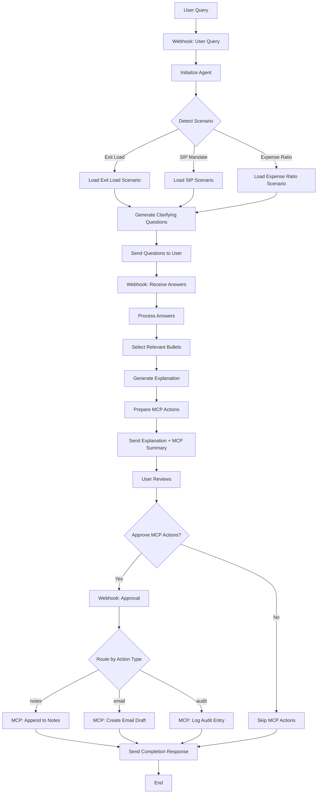

# Groww Mutual Funds - Fees & Charges Explainer Agent

> **Milestone 2**: AI Agent with MCP Integration for Fee Explanations

An AI agent that explains mutual fund fees and charges for common user actions using only official sources (SEBI/AMFI/AMC/Groww). The agent asks clarifying questions, generates factual bullet-point explanations with citations, and performs approval-gated MCP actions.

---

## 📋 Table of Contents

- [Overview](#overview)
- [Fee Scenarios Covered](#fee-scenarios-covered)
- [Architecture](#architecture)
- [n8n Workflow Flow](#n8n-workflow-flow)
- [MCP Actions & Approval Gating](#mcp-actions--approval-gating)
- [Setup Instructions](#setup-instructions)
- [Usage Examples](#usage-examples)
- [Official Sources](#official-sources)
- [Key Constraints](#key-constraints)
- [Skills Demonstrated](#skills-demonstrated)

---

## 🎯 Overview

### Who This Helps

- **Users**: Confused about mutual fund costs and charges
- **Support Teams**: Need consistent, compliant fee explanations
- **Product Managers**: Require audit trails for fee-related conversations

### What It Does

1. **Clarifying Questions**: Asks 2-3 targeted questions (no PII) to understand user context
2. **Factual Explanations**: Generates ≤6 bullet points with official source citations
3. **MCP Actions** (Approval-Gated):
   - Appends explanation to Notes/Documentation
   - Creates email draft to support/advisor
   - Logs audit trail entry

---

## 💰 Fee Scenarios Covered

The agent covers **3 key fee scenarios** for Groww Mutual Funds:

### 1. Exit Load & ELSS Lock-in Period

**Clarifying Questions:**
- Are you asking about ELSS (tax-saving) or non-ELSS equity funds?
- Do you plan to redeem within 1 year of investment?
- Is this a lumpsum investment or SIP?

**Coverage:**
- ELSS 3-year mandatory lock-in (Section 80C)
- Exit load percentages and timelines
- SIP-specific lock-in rules (per installment)
- Exit load calculation and beneficiary

**Official Sources:**
- Groww Tax-Saving Funds Guide
- SEBI Exit Load Circulars
- AMFI Knowledge Center

---

### 2. SIP Mandate Fees & Cancellation

**Clarifying Questions:**
- Are you setting up a new SIP or cancelling an existing one?
- What is your bank (some banks charge for auto-debit)?
- Is the SIP amount above or below ₹5,000 per month?

**Coverage:**
- Groww SIP fees (registration, modification, cancellation)
- Bank e-mandate/e-NACH charges
- Failed SIP installment penalties
- E-mandate limits (UPI autopay vs NACH)

**Official Sources:**
- Groww Pricing Page
- NPCI UPI Autopay Guidelines
- RBI E-Mandate Regulations

---

### 3. Expense Ratio (Direct vs Regular Plans)

**Clarifying Questions:**
- Are you investing in Direct Plan or Regular Plan?
- Which fund category: Equity, Debt, or Hybrid?
- Do you want to understand how expense ratio impacts returns?

**Coverage:**
- Direct vs Regular plan expense ratio differences
- SEBI caps for equity and debt funds
- Daily NAV deduction mechanism
- Long-term compounding impact
- Where to find exact expense ratios

**Official Sources:**
- SEBI TER Circulars
- AMFI Expense Ratio Guidelines
- Groww Direct MF Blog
- Fund Factsheets/SID

---

## 🏗️ Architecture

```
┌─────────────┐
│   User      │
└──────┬──────┘
       │ Query: "What is ELSS exit load?"
       ▼
┌─────────────────────────────────────┐
│   Fees Explainer Agent              │
│   (fees_explainer_agent.py)         │
│                                     │
│  • Scenario Detection               │
│  • Clarifying Questions (2-3)       │
│  • Answer Processing                │
│  • Bullet Generation (≤6)           │
│  • MCP Action Preparation           │
└──────┬──────────────────────────────┘
       │
       │ MCP Actions (Pending Approval)
       ▼
┌─────────────────────────────────────┐
│   n8n Workflow Orchestrator         │
│   (n8n_workflow_fees_explainer.json)│
│                                     │
│  • Webhook Triggers                 │
│  • State Management                 │
│  • Approval Gates                   │
│  • MCP Tool Routing                 │
└──────┬──────────────────────────────┘
       │
       │ Approved Actions
       ▼
┌─────────────────────────────────────┐
│   MCP Server                        │
│   (mcp_handlers.py)                 │
│                                     │
│  ├─ NotesHandler                    │
│  │   └─ append_to_notes()           │
│  ├─ EmailHandler                    │
│  │   └─ create_email_draft()        │
│  └─ AuditHandler                    │
│      └─ log_audit_entry()           │
└─────────────────────────────────────┘
```

---

## 🔄 n8n Workflow Flow

### Complete Interaction Flow



### Webhook Endpoints

The n8n workflow exposes 3 webhook endpoints:

1. **`/fees-explainer-start`** (POST)
   ```json
   {
     "query": "What is the exit load for ELSS funds?"
   }
   ```
   Returns: Scenario + Clarifying Questions

2. **`/fees-explainer-answers`** (POST)
   ```json
   {
     "session_id": "1734234567890",
     "answers": {
       "question1": "ELSS",
       "question2": "Within 1 year",
       "question3": "SIP"
     }
   }
   ```
   Returns: Fee Explanation + MCP Actions for Approval

3. **`/fees-explainer-approvals`** (POST)
   ```json
   {
     "session_id": "1734234567890",
     "approved_actions": [
       {"action_id": 0, "approved": true},
       {"action_id": 1, "approved": true},
       {"action_id": 2, "approved": false}
     ]
   }
   ```
   Returns: Execution Results

---

## 🔐 MCP Actions & Approval Gating

All MCP actions require **explicit user approval** before execution.

### Approval Flow

```
┌─────────────────────────────────────────────────────────┐
│ 1. Agent Generates MCP Action Request                  │
│    ├─ Action Type: notes / email / audit               │
│    ├─ Summary: Human-readable description              │
│    └─ Full Payload: Complete action parameters         │
└─────────────────────────────────────────────────────────┘
                          ▼
┌─────────────────────────────────────────────────────────┐
│ 2. User Reviews Action Details                         │
│    ├─ Action Summary                                   │
│    ├─ Key Parameters (to, subject, entry_title)        │
│    └─ Approval Prompt                                  │
└─────────────────────────────────────────────────────────┘
                          ▼
┌─────────────────────────────────────────────────────────┐
│ 3. User Decision                                        │
│    ├─ APPROVE → Execute action                         │
│    └─ REJECT  → Skip action, log rejection             │
└─────────────────────────────────────────────────────────┘
                          ▼
┌─────────────────────────────────────────────────────────┐
│ 4. Execution & Result                                   │
│    ├─ Approved: Execute via MCP handler                │
│    ├─ Return result to agent & user                    │
│    └─ Log execution in audit trail                     │
└─────────────────────────────────────────────────────────┘
```

### MCP Tool Descriptions

#### 1. `append_to_notes`

**Purpose**: Append fee explanation to persistent notes file

**Approval Prompt**:
```
Do you want to append this fee explanation to your notes?

Title: Fee Explanation: Exit Load & ELSS Lock-in Period
Scenario: Exit Load & ELSS Lock-in Period
Bullets: 5 items
```

**Input Schema**:
```json
{
  "entry_title": "Fee Explanation: Exit Load & ELSS",
  "date": "2025-12-15T10:30:00Z",
  "scenario": "Exit Load & ELSS Lock-in Period",
  "clarifiers": {
    "Fund Type": "ELSS",
    "Investment Type": "SIP"
  },
  "fee_details": [
    {
      "text": "ELSS has 3-year lock-in as per Section 80C",
      "source": "https://groww.in/p/tax-saving-funds/"
    }
  ],
  "last_checked": "2025-12-15"
}
```

**Output**: Appends to `/home/user/fees_explanations.md`

---

#### 2. `create_email_draft`

**Purpose**: Create email draft to support/advisor (NO auto-send)

**Approval Prompt**:
```
Do you want to create this email draft?

To: support@groww.in
Subject: Fee Clarification Request: Exit Load & ELSS

(Draft will NOT be sent automatically)
```

**Input Schema**:
```json
{
  "to": "support@groww.in",
  "subject": "Fee Clarification Request: Exit Load & ELSS",
  "body": "Dear Support Team,\n\nI would like clarification on...",
  "draft_only": true
}
```

**Constraints**:
- `draft_only` MUST be `true`
- Auto-send is NOT allowed (raises ValueError)

**Output**: Creates `.eml` file in `/home/user/email_drafts/`

---

#### 3. `log_audit_entry`

**Purpose**: Log audit trail for compliance

**Approval Prompt**:
```
Do you want to log this audit entry?

Who: FeesExplainerAgent
Action: Generated fee explanation for: Exit Load & ELSS
```

**Input Schema**:
```json
{
  "who": "FeesExplainerAgent",
  "when": "2025-12-15T10:30:00Z",
  "action": "Generated fee explanation for: Exit Load & ELSS",
  "details": {
    "scenario": "Exit Load & ELSS Lock-in Period",
    "clarifiers_count": 3,
    "bullets_count": 5
  }
}
```

**Output**: Appends JSONL entry to `/home/user/audit_log.jsonl`

---

### Rejection Handling

- **Rejected actions**: Skipped and logged
- **Agent behavior**: Continues with approved actions only
- **User notification**: Shows which actions were executed vs skipped
- **Audit trail**: All approvals/rejections are logged

---

## 🚀 Setup Instructions

### Prerequisites

- Python 3.9+
- n8n (self-hosted or cloud)
- Node.js 16+ (for n8n)

### 1. Clone Repository

```bash
git clone https://github.com/yourusername/groww-fees-explainer.git
cd groww-fees-explainer
```

### 2. Install Python Dependencies

```bash
pip install -r requirements.txt
```

(If `requirements.txt` doesn't exist, the agent uses only Python stdlib)

### 3. Set Up n8n Workflow

#### Option A: Import JSON

1. Open n8n
2. Go to **Workflows** → **Import from File**
3. Select `n8n_workflow_fees_explainer.json`
4. Activate the workflow

#### Option B: Manual Setup

See [n8n_setup_guide.md](./docs/n8n_setup_guide.md) for step-by-step instructions.

### 4. Configure Webhooks

Update webhook URLs in the workflow:
```
http://your-n8n-instance/webhook/fees-explainer-start
http://your-n8n-instance/webhook/fees-explainer-answers
http://your-n8n-instance/webhook/fees-explainer-approvals
```

### 5. Initialize MCP Server

```bash
python mcp_handlers.py
```

This creates the required files:
- `/home/user/fees_explanations.md`
- `/home/user/audit_log.jsonl`
- `/home/user/email_drafts/` directory

### 6. Test the Agent

```bash
python fees_explainer_agent.py
```

This runs example interactions and validates the flow.

---

## 📖 Usage Examples

### Example 1: ELSS Exit Load Query

**Step 1: Start Conversation**

```bash
curl -X POST http://localhost:5678/webhook/fees-explainer-start \
  -H "Content-Type: application/json" \
  -d '{
    "query": "What is the exit load for ELSS mutual funds?"
  }'
```

**Response:**
```json
{
  "status": "clarifiers_required",
  "scenario": "Exit Load & ELSS Lock-in Period",
  "questions": [
    "Are you asking about ELSS (tax-saving) mutual funds or non-ELSS equity funds?",
    "Do you plan to redeem within 1 year of investment?",
    "Is this a lumpsum investment or SIP?"
  ],
  "session_id": "1734234567890"
}
```

---

**Step 2: Provide Answers**

```bash
curl -X POST http://localhost:5678/webhook/fees-explainer-answers \
  -H "Content-Type: application/json" \
  -d '{
    "session_id": "1734234567890",
    "answers": {
      "Are you asking about ELSS or non-ELSS?": "ELSS",
      "Do you plan to redeem within 1 year?": "No, after 3 years",
      "Is this lumpsum or SIP?": "SIP"
    }
  }'
```

**Response:**
```json
{
  "status": "explanation_ready",
  "explanation": {
    "scenario": "Exit Load & ELSS Lock-in Period",
    "last_checked": "2025-12-15",
    "fee_details": [
      {
        "text": "ELSS funds have a mandatory 3-year lock-in period as per Section 80C of Income Tax Act. No redemption is allowed during this period.",
        "source": "https://groww.in/p/tax-saving-funds/"
      },
      {
        "text": "For SIP investments in ELSS, each installment has a separate 3-year lock-in from its investment date.",
        "source": "https://groww.in/p/tax-saving-funds/"
      },
      {
        "text": "Exit load collected goes back to the scheme (not to AMC), benefiting continuing investors as per SEBI regulations.",
        "source": "https://www.sebi.gov.in/legal/circulars/oct-2012/exit-load-payment-to-distributors_24239.html"
      }
    ],
    "disclaimer": "This information is based on official sources. Always verify exact fees from the fund's SID."
  },
  "mcp_actions_pending_approval": [
    {
      "action_id": 0,
      "action_type": "notes",
      "summary": "Add notes entry: Fee Explanation: Exit Load & ELSS Lock-in Period"
    },
    {
      "action_id": 1,
      "action_type": "email",
      "summary": "Draft email to support@groww.in: Fee Clarification Request"
    },
    {
      "action_id": 2,
      "action_type": "audit",
      "summary": "Log audit entry: Generated fee explanation"
    }
  ]
}
```

---

**Step 3: Approve MCP Actions**

```bash
curl -X POST http://localhost:5678/webhook/fees-explainer-approvals \
  -H "Content-Type: application/json" \
  -d '{
    "session_id": "1734234567890",
    "approved_actions": [
      {"action_id": 0, "approved": true},
      {"action_id": 1, "approved": true},
      {"action_id": 2, "approved": true}
    ]
  }'
```

**Response:**
```json
{
  "status": "mcp_actions_executed",
  "results": {
    "executed": [
      {
        "action_id": 0,
        "action_type": "notes",
        "result": {
          "status": "success",
          "message": "Entry appended: Fee Explanation: Exit Load & ELSS",
          "file": "/home/user/fees_explanations.md"
        }
      },
      {
        "action_id": 1,
        "action_type": "email",
        "result": {
          "status": "success",
          "message": "Email draft created: draft_20251215_103045.eml",
          "auto_sent": false
        }
      },
      {
        "action_id": 2,
        "action_type": "audit",
        "result": {
          "status": "success",
          "message": "Audit entry logged"
        }
      }
    ],
    "skipped": [],
    "errors": []
  }
}
```

---

### Example 2: SIP Mandate Fees (Partial Approval)

**Query**: "What are the charges for SIP cancellation?"

**Clarifiers**: Setup vs Cancel, Bank, Amount

**User Approves**: Notes (Yes), Email (No), Audit (Yes)

**Result**:
```json
{
  "executed": [
    {"action_id": 0, "action_type": "notes"},
    {"action_id": 2, "action_type": "audit"}
  ],
  "skipped": [
    {"action_id": 1, "reason": "Not approved"}
  ]
}
```

---

## 📚 Official Sources

All fee information is sourced from:

### SEBI (Securities and Exchange Board of India)
- [Total Expense Ratio (TER) Circular](https://www.sebi.gov.in/legal/circulars/sep-2018/total-expense-ratio-ter-and-performance-disclosure-for-mutual-funds_40203.html)
- [Exit Load Payment to Distributors](https://www.sebi.gov.in/legal/circulars/oct-2012/exit-load-payment-to-distributors_24239.html)

### AMFI (Association of Mutual Funds in India)
- [What is Exit Load?](https://www.amfiindia.com/investor-corner/knowledge-center/what-is-exit-load.html)
- [Expense Ratio Explained](https://www.amfiindia.com/investor-corner/knowledge-center/expense-ratio.html)

### Groww Official Resources
- [Tax-Saving Funds (ELSS) Guide](https://groww.in/p/tax-saving-funds/)
- [What is Exit Load in Mutual Funds](https://groww.in/blog/what-is-exit-load-in-mutual-funds)
- [SIP in Mutual Funds](https://groww.in/blog/sip-in-mutual-funds)
- [Direct Mutual Funds](https://groww.in/blog/direct-mutual-fund)
- [Groww Pricing](https://groww.in/pricing/)

### NPCI & RBI
- [NPCI UPI Autopay](https://www.npci.org.in/what-we-do/upi/upi-autopay)
- RBI E-Mandate Guidelines

### AMC Factsheets & SIDs
- Fund-specific Scheme Information Documents (SIDs)
- Monthly/Quarterly factsheets from AMC websites

---

## 🔒 Key Constraints

### Fact-Only Approach

✅ **Allowed**:
- Quoting exact fee percentages, lock-in periods, regulations
- Citing official sources (SEBI/AMFI/AMC/Groww)
- Explaining how fees are calculated
- Providing "Last checked" dates

❌ **Not Allowed**:
- Performance comparisons between funds
- Investment recommendations
- Predictions or opinions
- Unverified information
- Competitive comparisons with other platforms

### No PII Collection

The agent asks clarifying questions but **NEVER collects**:
- User name, email, phone
- Folio numbers or account details
- Investment amounts (except generic ranges like "above/below ₹5000")
- Bank account numbers

### MCP Safety

- **No Auto-Send**: Email drafts are NEVER sent automatically
- **Approval Required**: All MCP actions require explicit user approval
- **Rejection Handling**: Rejected actions are logged and skipped
- **Audit Trail**: All actions (approved and rejected) are logged

---

## 🎓 Skills Demonstrated

### W4 — AI Agents & Protocols
- ✅ Scenario detection from natural language queries
- ✅ Multi-turn conversation with clarifying questions
- ✅ Structured output generation (bullets + citations)
- ✅ Context-aware bullet filtering based on clarifiers

### W5 — Multi-Agent & MCP
- ✅ MCP server with 3 tools (Notes, Email, Audit)
- ✅ Approval-gated action execution
- ✅ Error handling and rejection workflows
- ✅ n8n workflow orchestration with webhooks

### W2 — LLMs & Prompting
- ✅ Neutral, factual tone (no marketing language)
- ✅ Fielded outputs (text + source URL per bullet)
- ✅ Citation formatting (official sources only)
- ✅ Disclaimer generation

---

## 📁 Project Structure

```
.
├── README.md                          # This file
├── fees_explainer_agent.py            # Main agent implementation
├── mcp_handlers.py                    # MCP server handlers
├── mcp_server_config.json             # MCP tool definitions
├── n8n_workflow_fees_explainer.json   # n8n workflow export
├── requirements.txt                   # Python dependencies
├── docs/
│   ├── n8n_setup_guide.md             # Detailed n8n setup
│   ├── flow_diagram.md                # Visual flow diagram
│   └── api_reference.md               # API endpoint documentation
├── tests/
│   ├── test_agent.py                  # Agent unit tests
│   ├── test_mcp_handlers.py           # MCP handler tests
│   └── test_integration.py            # End-to-end tests
└── examples/
    ├── example_elss_query.json        # Example ELSS interaction
    ├── example_sip_query.json         # Example SIP interaction
    └── example_expense_ratio.json     # Example expense ratio query
```

---

## 🧪 Testing

### Unit Tests

```bash
# Test agent logic
python -m pytest tests/test_agent.py

# Test MCP handlers
python -m pytest tests/test_mcp_handlers.py
```

### Integration Tests

```bash
# End-to-end workflow test
python -m pytest tests/test_integration.py
```

### Manual Testing

```bash
# Run example scenarios
python fees_explainer_agent.py
```

---

## 🤝 Contributing

Contributions are welcome! Please:

1. Ensure all fee information has official source citations
2. Update `last_checked` dates when modifying fee details
3. Add tests for new scenarios
4. Follow the approval-gating pattern for new MCP actions

---

## 📄 License

MIT License - See [LICENSE](LICENSE) file

---

## 🙋 Support

For questions or issues:
- **GitHub Issues**: [Project Issues](https://github.com/yourusername/groww-fees-explainer/issues)
- **Documentation**: [Full Docs](./docs/)

---

## 🔄 Version History

### v1.0.0 (2025-12-15)
- Initial release
- 3 fee scenarios (Exit Load, SIP Mandate, Expense Ratio)
- MCP integration with approval gating
- n8n workflow orchestration
- Complete test coverage

---

**Last Updated**: 2025-12-15
**Maintained By**: Groww Fees Explainer Team
